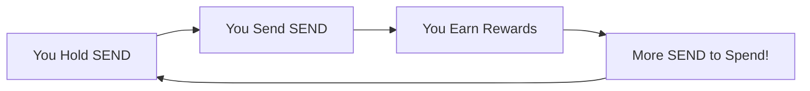
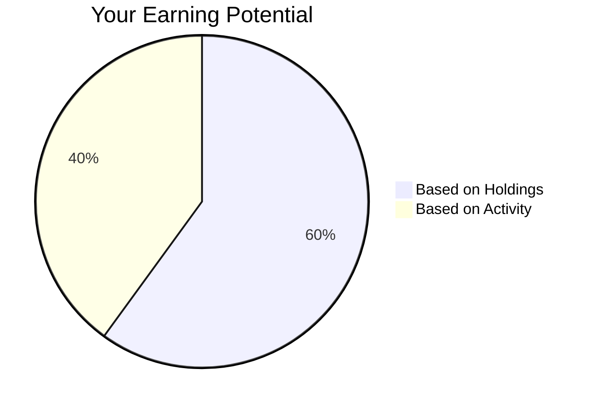
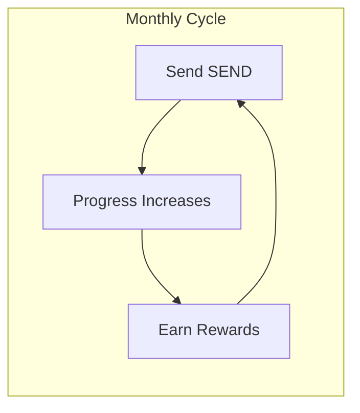

# Rewards - How It Works

Welcome! This guide explains how SEND rewards work in simple terms. Think of it like a loyalty program that pays you back for using your money.

## The Big Picture



SEND rewards you for actually using your money, not just sitting on it. The more you send to friends and family, the more you earn back!

---

## Step 1: Get Verified

Before you can earn rewards, you need to prove you're a real person. Here's what you need:

```mermaid
flowchart TD
    A[Start Here] --> B[Deposit {{REWARDS_DEPOSIT_USDC}} USDC]
    B --> C[Claim Your Sendtag]
    C --> D[Hold {{REWARDS_HOLD_SEND}} SEND]
    D --> E[You're Verified!]
```

Once verified, you're in the rewards club!

---

## Step 2: Hold to Set Your Limit

Your SEND balance decides how much you can earn. Think of it like a bucket - the more SEND you hold, the bigger your bucket can fill with rewards.



---

## Step 3: Send to Earn

This is the fun part! Every time you send SEND to someone:

- Your progress bar fills up
- You get closer to your monthly rewards
- The more you send, the more you earn



---

## Bonus: Tasks & Multipliers

Want to earn even faster? Complete simple tasks:

- Invite friends
- Stay verified
- Send regularly

Each task gives you bonus rewards, and streaks make them even bigger!

---

## The Bottom Line

> **Your money works harder when you use it.**
> Hold SEND, send SEND, earn more SEND. It's that simple!

:::tip Remember
The more active you are, the more you earn. SEND rewards spending, not just saving!
:::
