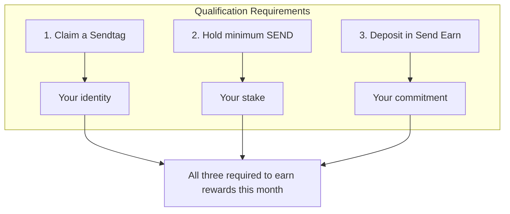
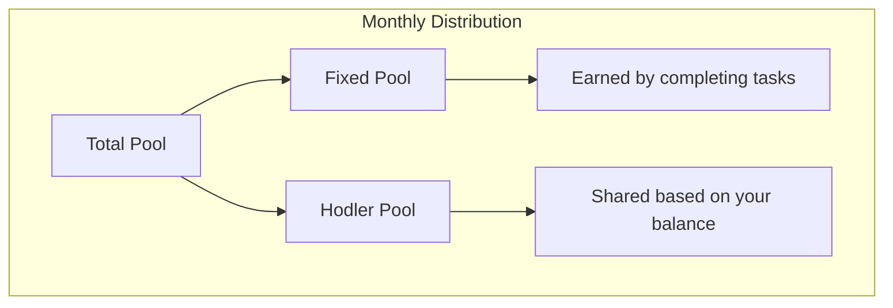
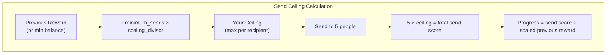
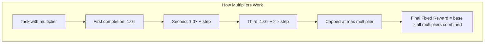
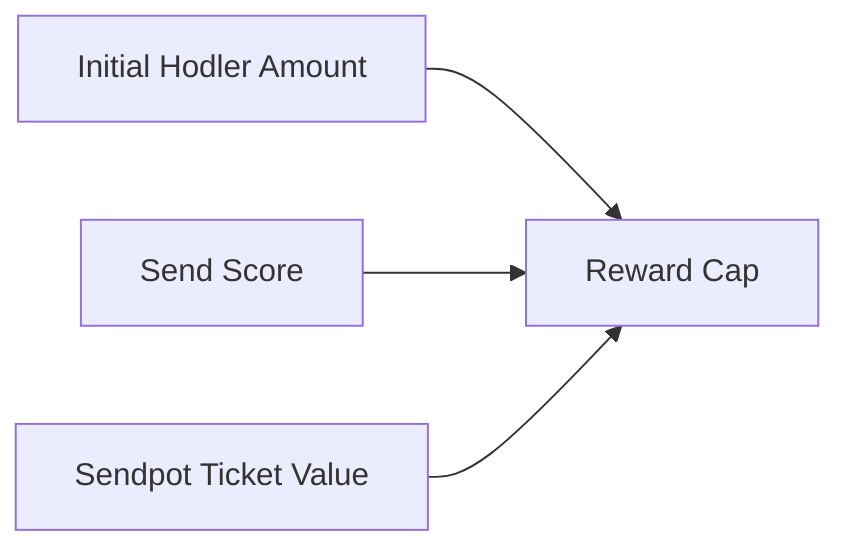
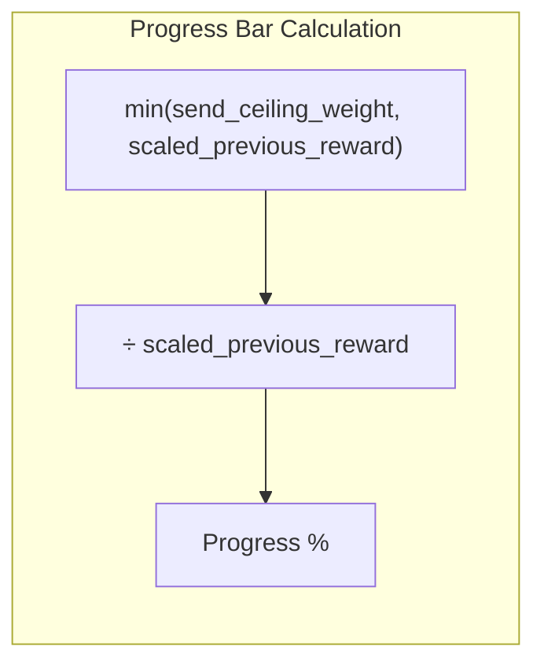

# SEND Rewards: How You Earn

SEND rewards you for sending tokens, not just holding them. The more you send SEND to others, the more you earn back next month.

---

## Getting Started: Three Things You Need

Before you can earn rewards, you need to complete three steps:

These requirements are checked at the monthly snapshot. Miss one, and you won't qualify for that month's distribution.

---

## How Your Reward Gets Calculated

Your monthly reward comes from two pools:

The fixed pool gets calculated first from your completed tasks. Whatever's left goes to the hodler pool, split among all qualified users based on their SEND balance.

---

## Your Send Ceiling: The Key to Unlocking Rewards

Here's the important part: **you must send SEND to unlock your rewards**.

Your "send ceiling" is the maximum you can earn, based on what you received last month (or the minimum balance if you're new). Every time you send SEND to someone who also has Send Earn deposits, it counts toward your progress.

**Key points:**
- Sends only count to recipients who have Send Earn deposits
- Each recipient is capped at your ceiling amount
- Your progress = how much of your potential you've activated

---

## Referral Marketing

One of the best ways to boost your rewards is through referrals. When you invite friends to Send and they become active users, you earn bonus multipliers on your rewards.

**How Referrals Work:**

1. Share your Sendtag with friends
2. When they sign up using your referral, you're connected as their referrer
3. Once your friend qualifies for rewards (by earning a share in a distribution), your referral counts

**Boosting Your Rewards with Referrals:**

Your referrals multiply your base rewards in two ways:

1. **Monthly Referral Multiplier**: For each friend who joins and qualifies in the current month, you get a 10% boost (1.1x, 1.2x, 1.3x...) up to 2x total

2. **Total Referral Multiplier**: Your lifetime qualified referrals give you an ongoing 2% boost per referral (1.02x, 1.04x, 1.06x...) up to 2x total

**Example:**
If you refer 3 friends this month who all qualify, and you have 10 total lifetime referrals:
- Monthly boost: 1.3x (3 referrals x 0.1 each)
- Total boost: 1.20x (10 referrals x 0.02 each)
- Combined multiplier: 1.3 x 1.2 = 1.56x your base rewards!

**Tips to Maximize Referrals:**

- Share your Sendtag on social media
- Invite friends who will actively use Send
- Help your referrals complete their first transactions so they qualify for rewards
- The more friends who qualify, the bigger your multiplier grows

---

## Tasks: Earn Fixed Bonuses

Tasks give you fixed token amounts for completing specific activities:

- **Claim a Sendtag** – Required for qualification
- **Create a backup passkey** – Secure your account
- **Send streak** – Send SEND on the day of the task
- **Buy Sendpot tickets** – Participate in the lottery

Each task has a fixed SEND value. Complete it, and that amount gets added to your reward.

**Remember:** Tasks must be completed each month. Your progress doesn't carry over to the next distribution.

---

## Multipliers: Boost Your Fixed Rewards

Some tasks have multipliers that increase your fixed pool earnings:

Multipliers are calculated per-distribution. They don't accumulate across months.

---

## The Reward Cap

Your fixed pool reward can never exceed:

This prevents gaming the system by completing tasks without actually participating in the economy.

---

## Progress Bar: What It Really Shows

The progress bar in the app shows how much of your send ceiling you've filled:

It doesn't show total SEND sent—it shows how much of your earning potential you've unlocked through qualifying sends.

---

## Quick Summary

1. **Qualify** – Sendtag + minimum SEND + Send Earn deposit
2. **Send** – Move SEND to eligible recipients to build your send score
3. **Complete tasks** – Earn fixed bonuses and multipliers
4. **Refer friends** – Boost your rewards with referral multipliers
5. **Receive** – At month-end, claim your share from fixed + hodler pools

The more you participate, the more you earn. But remember: everything resets each month. Stay active to keep earning.
