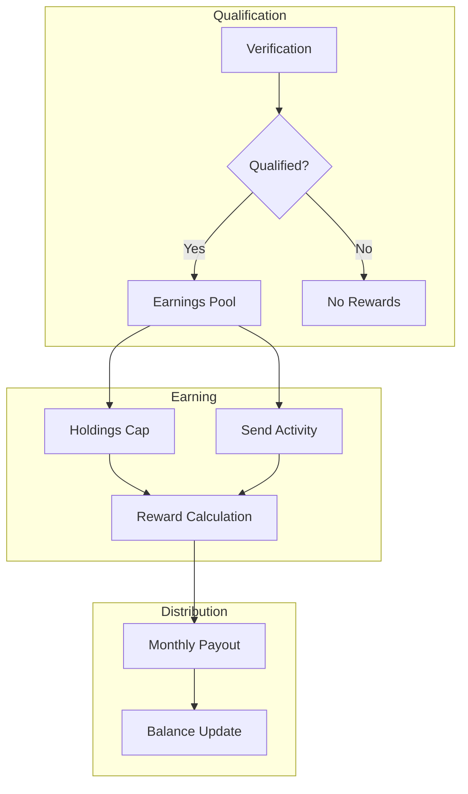
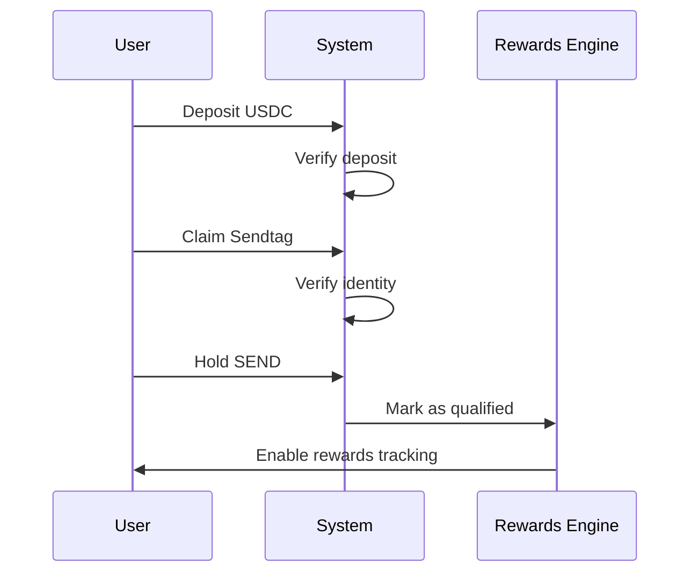
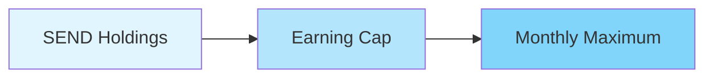
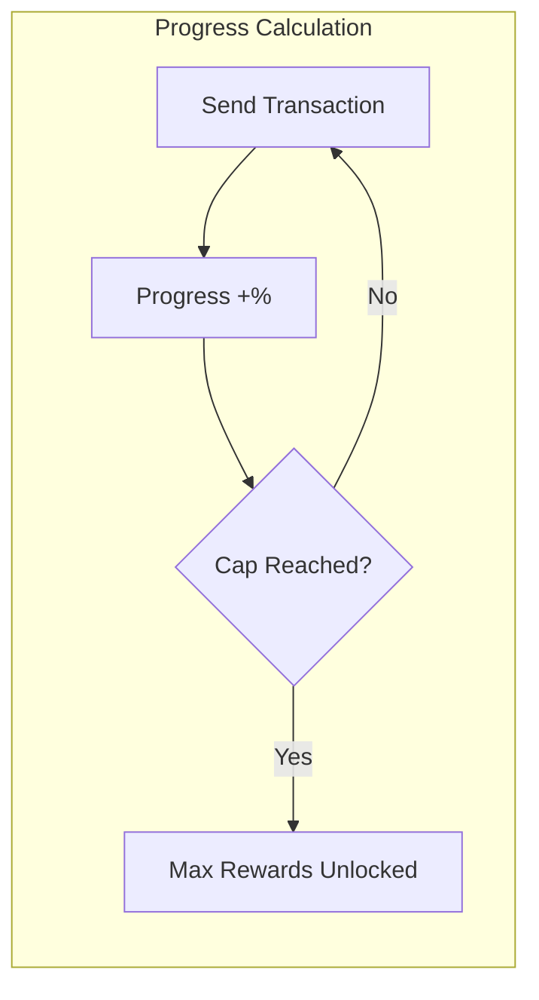
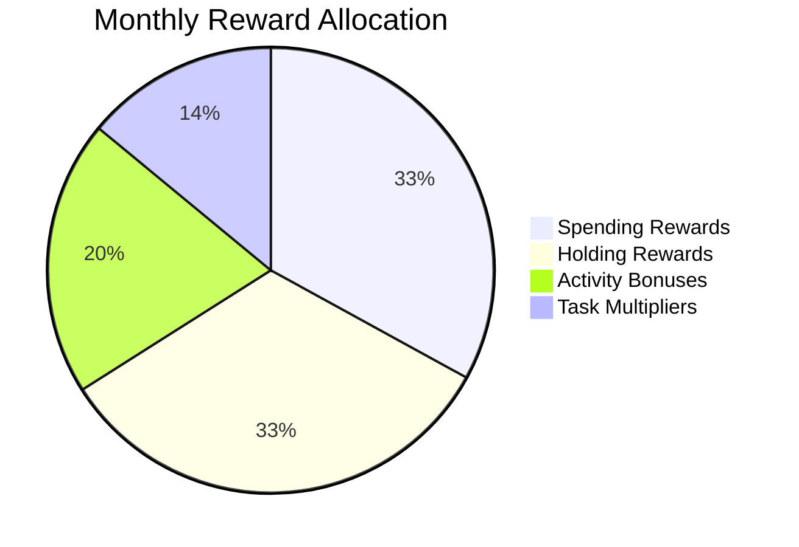
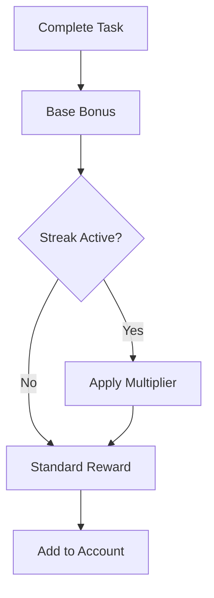
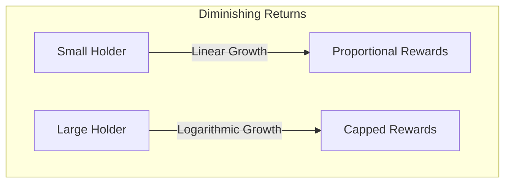

# SEND Rewards System

The SEND rewards framework incentivizes active participation in the network. This document provides a comprehensive overview of the qualification criteria, earning mechanics, and distribution model.

## System Architecture

## Verification Requirements

Users must complete three verification steps to qualify for rewards:

| Requirement | Threshold | Purpose |
|------------|-----------|---------|
| USDC Deposit | {{REWARDS_DEPOSIT_USDC}} USDC | Proof of funds |
| Sendtag | 1 claimed | Identity verification |
| SEND Holdings | {{REWARDS_HOLD_SEND}} SEND | Network commitment |

## Earning Mechanics

### Holdings-Based Cap

Your SEND holdings determine your maximum earning potential each cycle:

### Activity-Based Progress

Sending activity fills your progress toward the earning cap:

## Reward Distribution Model

### Distribution Timeline

| Phase | Timing | Action |
|-------|--------|--------|
| Tracking | Ongoing | Activity recorded |
| Calculation | Month end | Rewards computed |
| Distribution | 1st of month | SEND distributed |

## Task & Multiplier System

### Available Tasks

- Referral completions
- Verification maintenance
- Consistent sending activity
- Special promotional tasks

## Fairness Considerations

The system implements diminishing returns for large holders:

This ensures sustainable distribution while maintaining incentives for all participation levels.

---

:::info Key Takeaway
The SEND rewards system balances holding incentives with activity requirements, ensuring sustainable growth through verified participation.
:::
