# Rewards

SEND rewards you for circulating value — not just holding it.
When you send SEND to others, you're fueling the network and earning future SEND to spend again.
Each part of the system exists to make that cycle sustainable and fair.

---

### 🪪 Get Verified First — *Who earns future SEND*

Only verified users earn future SEND from what they spend.
Verification confirms you're real, active, and funded — the foundation for fair rewards.

To qualify, complete three trust steps:
* Deposit **{{REWARDS_DEPOSIT_USDC}} USDC** into your savings vault
* Claim your **Sendtag**
* Hold at least **{{REWARDS_HOLD_SEND}} SEND**

Once verified, every SEND you move starts counting toward your next cycle of rewards. Your spending now begins generating its return.

---

### 💰 Hold = Potential — *How much you can earn back*

Your SEND balance defines your earning ceiling — how much future SEND you can unlock.
Holding sets your upper limit; sending determines how much of it you realize.

Holding alone doesn't pay rewards, but it decides the size of your monthly slice. The more SEND you hold, the more your sending activity can return to you as future SEND to spend again.

---

### 💌 Send = Progress — *Why sending triggers rewards*

Sending SEND activates your rewards.
Every verified send proves real circulation — real movement of value between people.
As you send, your progress bar fills, showing how much of your potential you've unlocked.

Each month, SEND pays back part of what you circulate — giving you future SEND to spend again.

---

### 🧩 Tasks & Multipliers — *What accelerates your return*

Tasks are small challenges that keep the economy active — inviting friends, staying verified, sending regularly.
Each task gives bonus rewards, and multipliers amplify those bonuses the longer you stay active.

If your rewards stop increasing, you've hit your cap. You can raise it by **holding more SEND** or **sending SEND more often.**
The more you contribute, the faster you earn back future SEND to spend again.

```mermaid
flowchart TD
    subgraph TASKS["Task Categories"]
        T1["Sendtag Claim"] --> R1["Fixed Reward"]
        T2["Backup Passkey"] --> R2["Fixed Reward"]
        T3["Send Streak"] --> R3["Fixed Reward + Multiplier"]
        T4["Referrals"] --> R4["Fixed Reward + Multiplier"]
    end

    subgraph CALCULATION["Multiplier Calculation"]
        M1["Base Reward"] --> M2["× Streak Multiplier"]
        M2 --> M3["× Referral Multiplier"]
        M3 --> M4["= Boosted Fixed Reward"]
    end

    subgraph CAP["Reward Cap Check"]
        M4 --> C1{"Exceeds Cap?"}
        C1 -->|Yes| C2["Capped at Maximum"]
        C1 -->|No| C3["Full Amount Applied"]
    end

    R1 & R2 & R3 & R4 --> M1
```

---

### ⚖️ Fairness & Balance — *Why it stays sustainable*

Big holders earn more, but with **diminishing returns.**
Smaller verified users still earn meaningful rewards through consistent activity.

SEND's fairness design ensures future SEND is distributed to real participants — not just large wallets — so the network remains healthy and rewards stay sustainable.

---

### 📈 Month-to-Month Growth — *How your effort compounds*

Each month builds on the last.
Your verified activity, holding, and sending streaks carry forward, slowly raising your earning ceiling over time.

The longer you participate, the more predictable your rewards become — and the more future SEND you earn to spend again.

---

### 🧘 Built for Spending — *Why SEND exists*

SEND was created to make spending powerful.
About one-third of all monthly rewards are reserved specifically for **spending SEND**.
That means when you use SEND — not just hold it — the system literally gives you more to spend next month.

Your money doesn't just move — it multiplies its reach.

---

### 🔁 The Loop — *What it all means*

**Hold → Send → Progress → Earn → Repeat**

You hold SEND to set your power.
You send SEND to activate it.
And each month, the network returns a portion as **future SEND to spend again.**

That's the loop that keeps SEND alive — a self-sustaining cycle of participation and reward.

---

### 💚 In One Line

> **SEND rewards you for spending.**
> Every send today fuels the cash flow you'll use tomorrow.
> The more you circulate SEND, the more future SEND you earn to spend again.

:::tip Roadmap Alignment
SEND's rewards framework will evolve alongside new product launches and future staking programs.
We'll update this page with any changes to qualification or payout mix before new products go live.
:::
