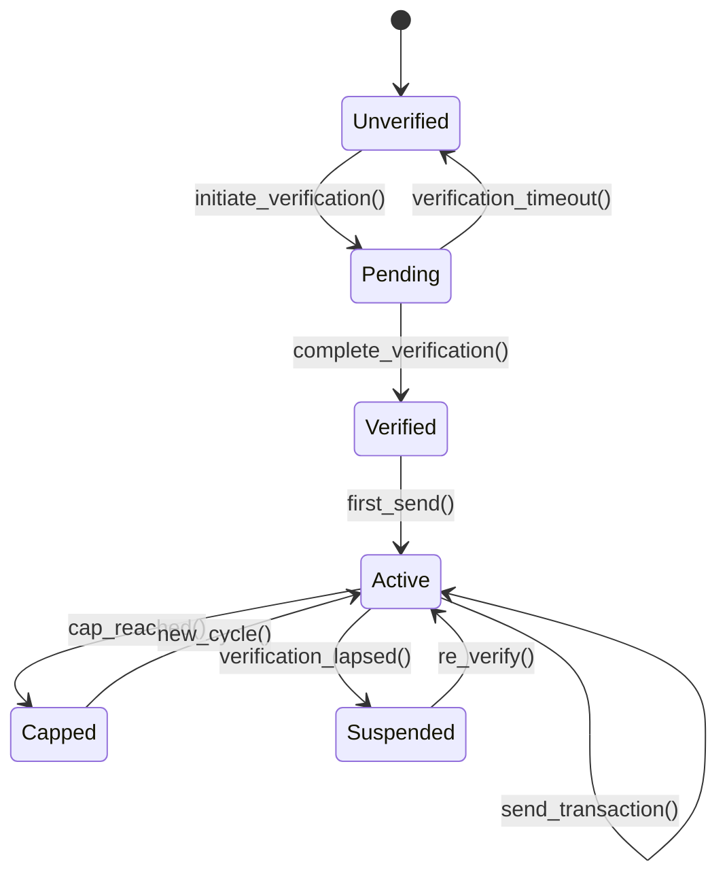
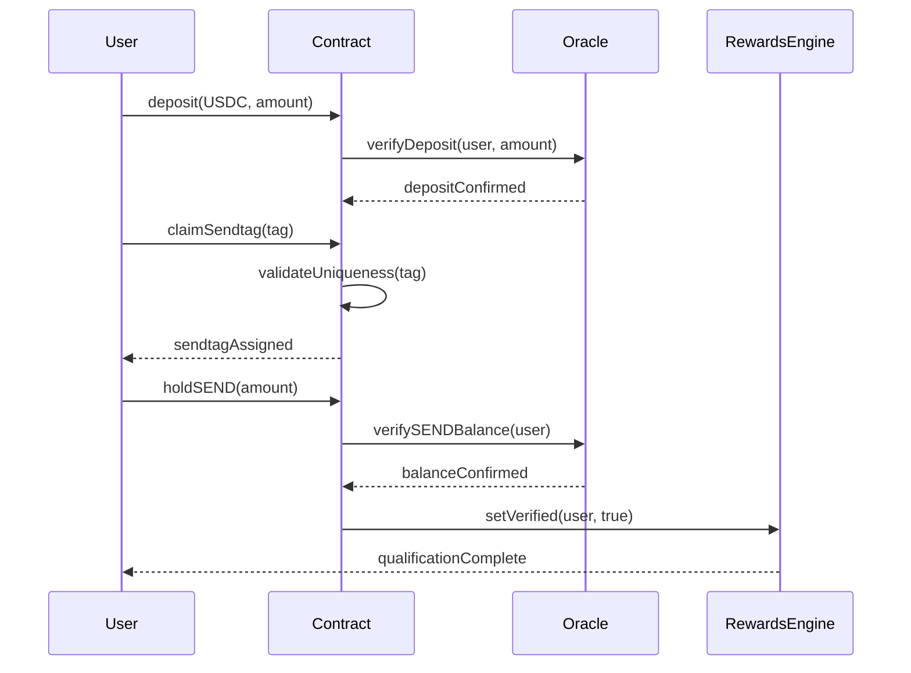
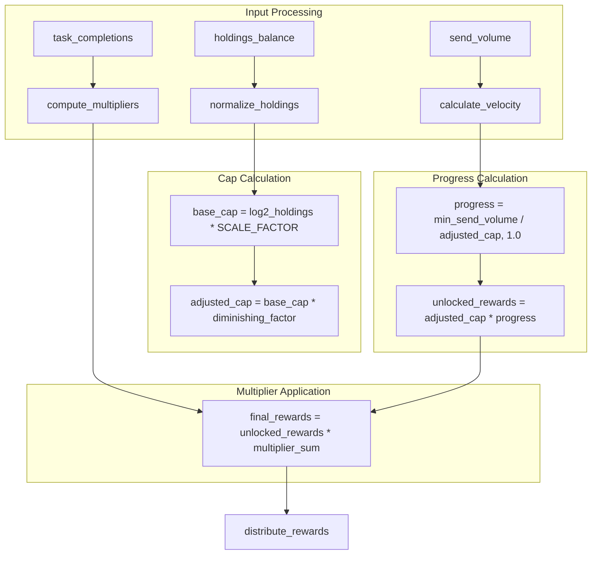
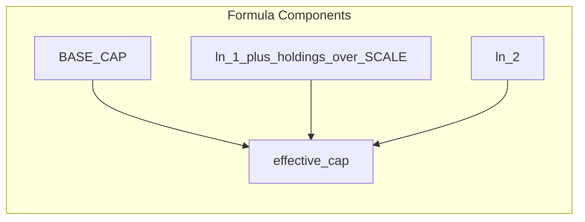
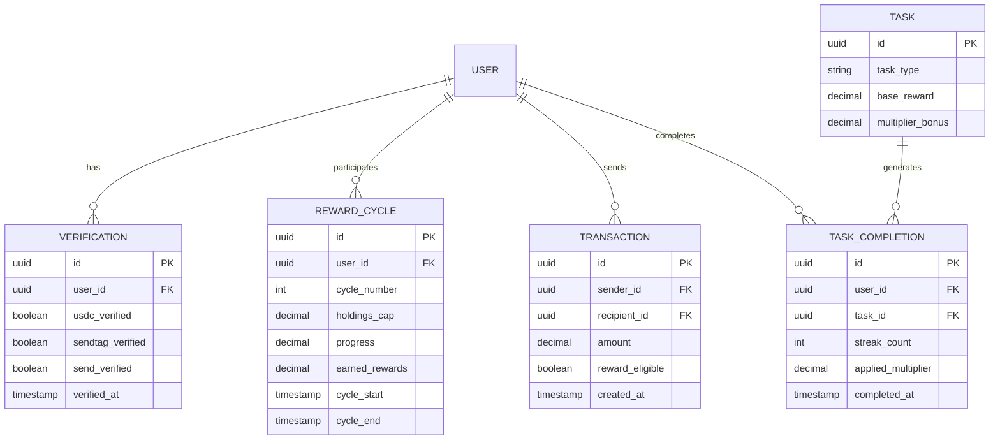
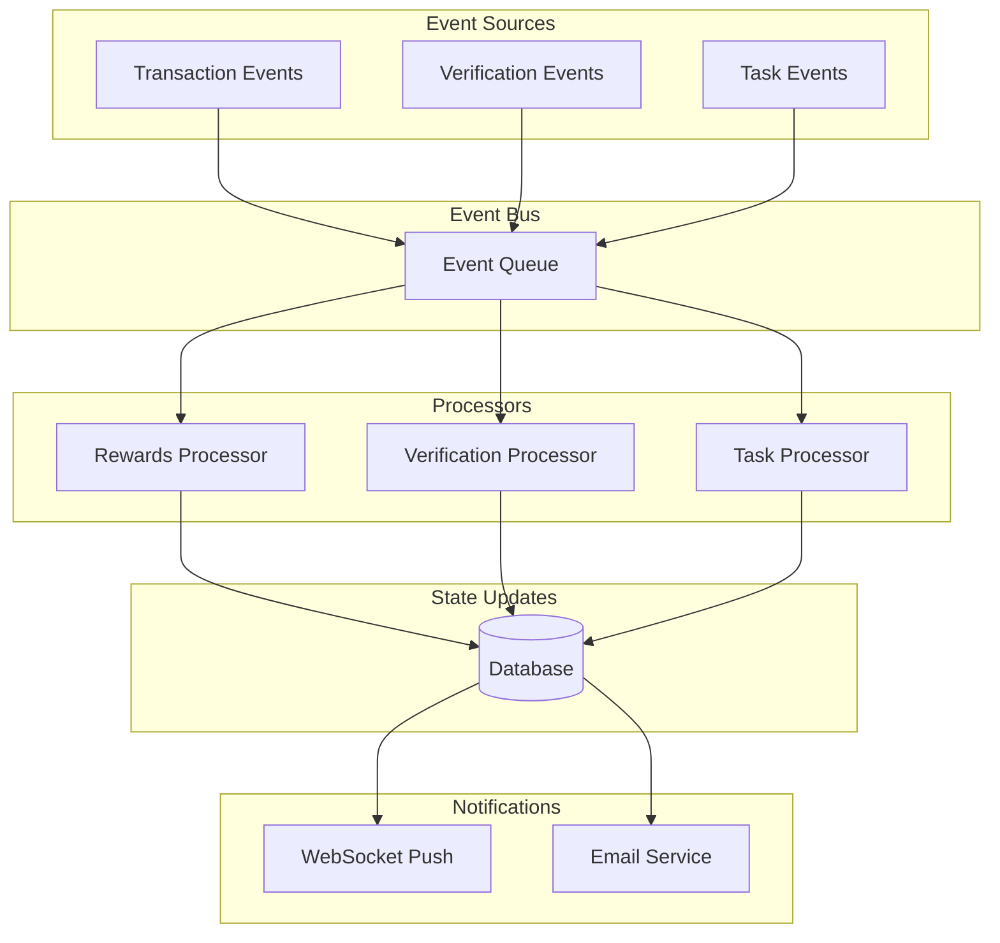
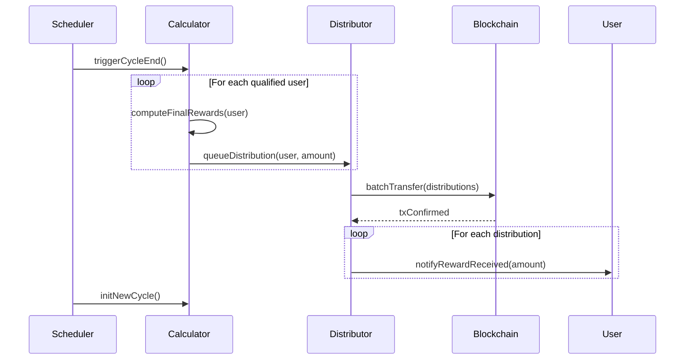
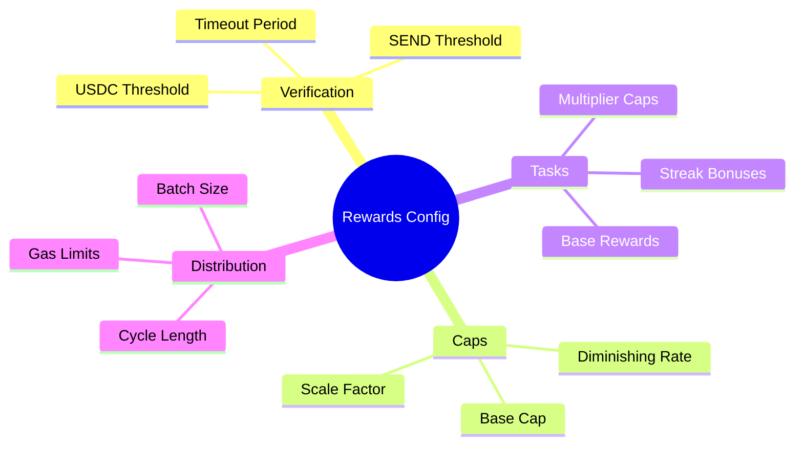
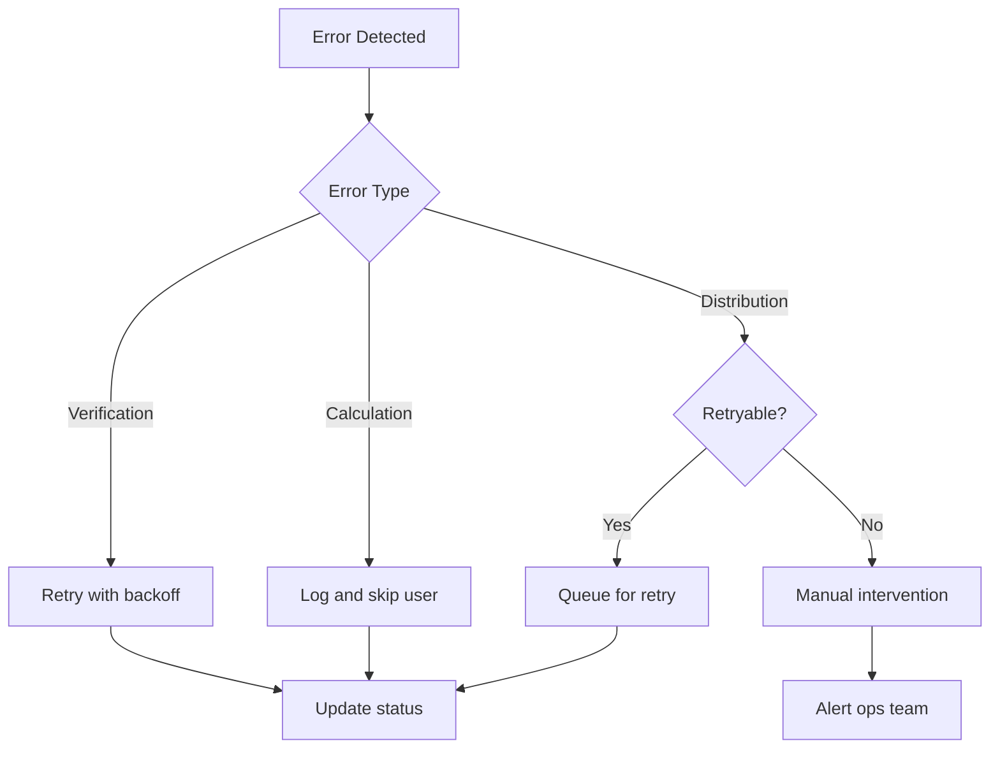

# SEND Rewards Technical Specification

This document provides the technical implementation details of the SEND rewards distribution system, including state transitions, calculation algorithms, and system interactions.

## System State Machine



## Verification State Transitions



## Rewards Calculation Engine

### Core Algorithm



### Diminishing Returns Formula

```
effective_cap = BASE_CAP * ln(1 + holdings / SCALE) / ln(2)

where:
  BASE_CAP = 10000 SEND (per cycle)
  SCALE = 1000 SEND
  holdings = user's SEND balance
```



## Database Schema



## Event Flow Architecture



## Monthly Distribution Process



## API Endpoints

| Endpoint | Method | Description |
|----------|--------|-------------|
| `/rewards/status` | GET | Current cycle status |
| `/rewards/history` | GET | Historical rewards |
| `/rewards/progress` | GET | Current progress |
| `/rewards/tasks` | GET | Available tasks |
| `/rewards/tasks/:id/complete` | POST | Complete task |

## Configuration Parameters



## Error Handling



---

:::warning Implementation Notes
- All timestamps are stored in UTC
- Decimal precision: 18 places for SEND amounts
- Event processing uses at-least-once delivery semantics
- Distribution batches limited to 100 transactions per block
:::
